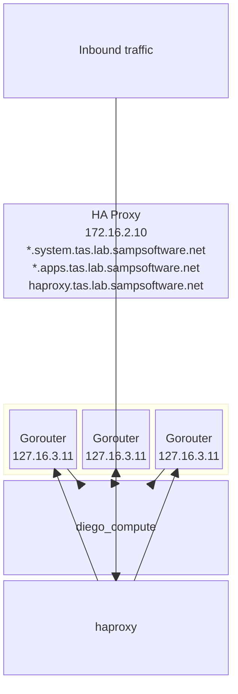

```mermaid
block-beta
    columns 1
    client["Inbound traffic"]
    space
    ooxy["HA Proxy 
        172.16.2.10
        *.system.tas.lab.sampsoftware.net
        *.apps.tas.lab.sampsoftware.net
        haproxy.tas.lab.sampsoftware.net
        "]
    space
    block:router
        gorouter1 ["
            Gorouter 
            127.16.3.11
            "]
        gorouter2 ["
            Gorouter 
            127.16.3.11
            "]
        gorouter3 ["
        Gorouter 
            127.16.3.11
            "]
    end
    diego_compute
    client --> haproxy
    haproxy --> gorouter1
    haproxy --> gorouter2
    haproxy --> gorouter3
    gorouter1-->diego_compute
    gorouter2-->diego_compute
    gorouter3-->diego_compute

    style client word-wrap: break-word;
```